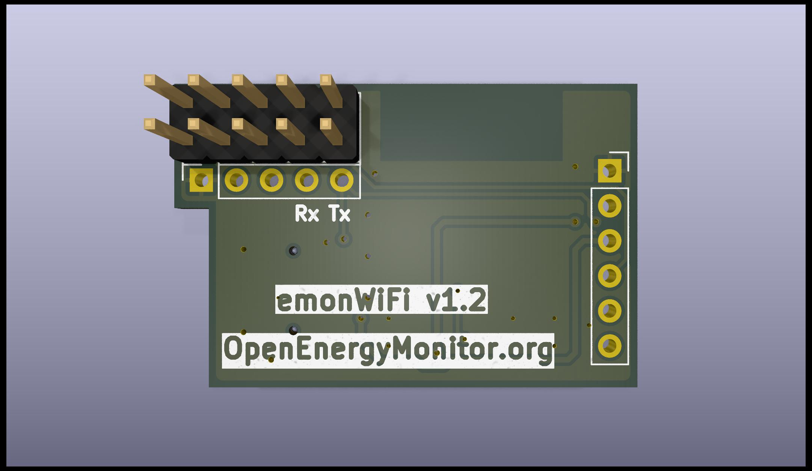
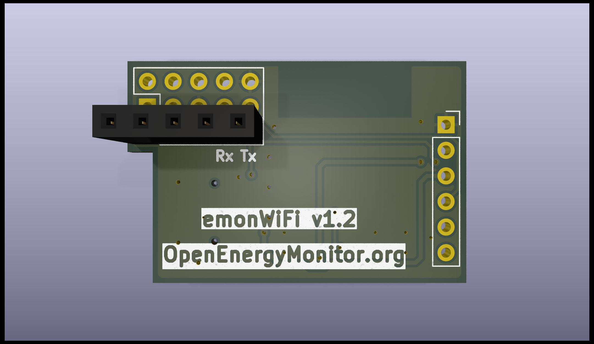
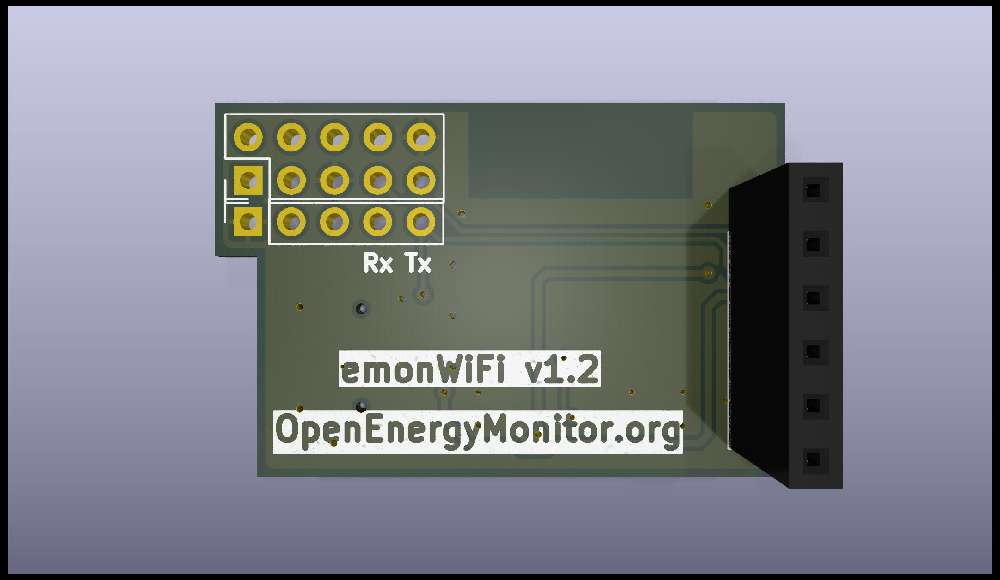

# emonWiFi

This small adapter allows [OpenEnergyMonitor](https://openenergymonitor.org) products to be used with a WiFi connection. The module is fully supported by [ESPHome](https://esphome.io/components/sensor/emontx/) and is compatible with many end points, for example [emonCMS](https://emoncms.org/), [Home Assistant](https://www.home-assistant.io/), and MQTT.

It is available for the following OpenEnergyMonitor products:

- [emonTx6 and emonPi3](https://github.com/openenergymonitor/emon32)
- [emonTx5 and emonPi2](https://github.com/openenergymonitor/emontx5)
- [emonTx4](https://github.com/openenergymonitor/emontx4)

The adapter uses a [Espressif ESP32-C3](https://www.espressif.com/en/products/socs/esp32-c3) and connects to the emonTx's serial port.

## Setup

### Installing software

To install firmware for the first time, hold down the button while plugging in the USB-C cable. This puts the ESP32 module into bootloader mode which allows firmware to be uploaded over the USB connection. After the first upload, you can use OTA updates.

The emonWiFi is [natively supported by ESPHome](https://esphome.io/components/sensor/emontx/). You can find instructions here or setup directly from Home Assistant.

### Installing the pin headers

You need to fit the connectors that correspond to the device you are attaching it to. There are different headers for each of the boards listed above. The headers face downwards, away from the side with the USB-C socket.

For an emonPi3 and emonTx6, a 2x5 **pin header** is installed in the position marked **Pi3**.

For an emonPi2 and emonTx5, a 5 position **socket** is installed in the position marked **Pi2**.

For an emonTx4, a 6 position **socket** is installed in the position marked **Tx4**.

### Installing on your emonTx

> [!WARNING]
> You must remove power from the emonTx before installing the emonWiFi. Failure to do so can result in damage to either, or both, of the devices.

> [!WARNING]
> Ensure you have placed the emonWiFi into the correct position for your emonTx before applying power. Failure to do can result in damage to either, or both, of the devices.

> [!WARNING]
> You must not connect the USB-C port of the emonWiFi while it is connected to the emonTx.

#### emonTx4

> [!NOTE]
> If you want to configure the emonTx4 over the WiFi connection, you must remove the solder bridge marked `JP6`. With this removed, you will not be able to configure the emonTx4 using the USB-C port

With the emonTx4's USB-C port facing downwards, insert the emonWiFi into the 6 pins in the centre left. The emonWiFi's USB-C port should face to the right.

#### emonTx5

> [!NOTE]
> If you want to configure the emonTx5 over the WiFi connection, you must cut the pad marked `USB_TX`. With this cut, you will not be able to configure the emonTx4 using the USB-C port. You can restore this functionality by applying a small solder bridge over the `USB_TX` pads.

With the emonTx6's USB-C port to the right, insert the emonWiFi into the pins below the Raspberry Pi socket as far to the right as possible with the emonWiFi's USB-C port also to the right.

#### emonTx6

With the emonTx6's USB-C port to the right, insert the emonWiFi into the 40pin socket towards the bottom as far to the right as possible with the emonWiFi's USB-C port also to the right.
