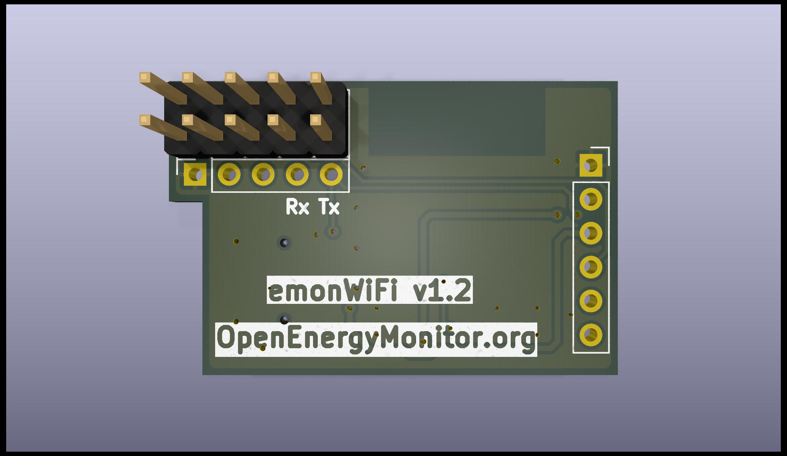
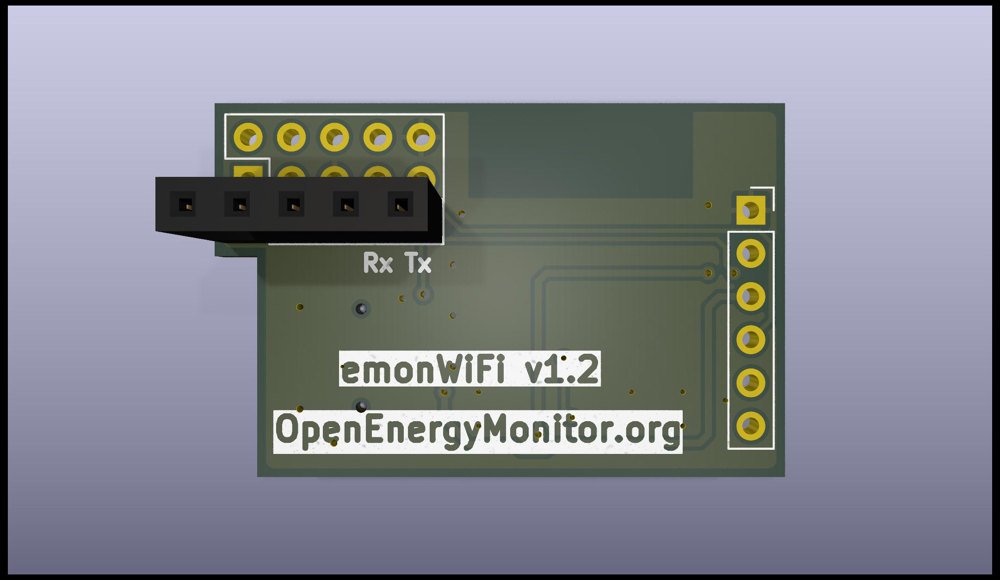
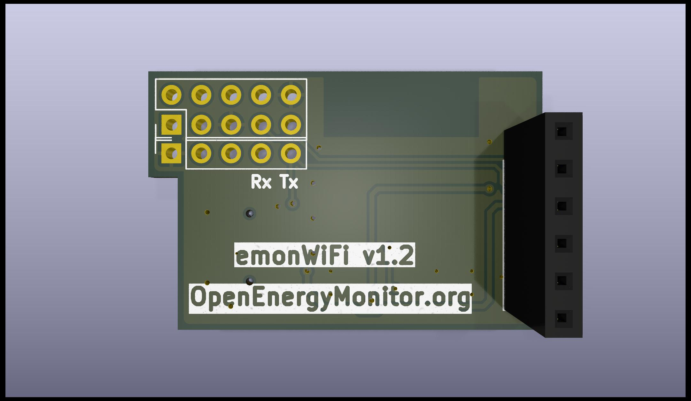

# emonWiFi

This small adapter allows [OpenEnergyMonitor](https://openenergymonitor.org) products to be used with a WiFi connection. The module is fully supported by [ESPHome](https://esphome.io/components/sensor/emontx/) and is compatible with many endpoints, for example [emonCMS](https://emoncms.org/), [Home Assistant](https://www.home-assistant.io/), and MQTT.

It is available for the following OpenEnergyMonitor products:

- [emonTx6 and emonPi3](https://github.com/openenergymonitor/emon32)
- [emonTx5 and emonPi2](https://github.com/openenergymonitor/emontx5)
- [emonTx4](https://github.com/openenergymonitor/emontx4)

The adapter uses an [Espressif ESP32-C3](https://www.espressif.com/en/products/socs/esp32-c3) and connects to the emonTx's serial port.

> [!WARNING]
> You must not connect the USB-C port of the emonWiFi while the emonWiFi is plugged into an emonTx. Doing so can cause damage to your emonTx.

## Hardware Setup

### Installing the pin headers

You need to fit the connectors that correspond to the device you are attaching it to. There are different headers for each of the boards listed above. The headers face downwards, away from the side with the USB-C socket.

For an emonPi3 and emonTx6, a 2x5 **pin header** is installed in the position marked **Pi3**.



For an emonPi2 and emonTx5, a 5 position **socket** is installed in the position marked **Pi2**.



For an emonTx4, a 6 position **socket** is installed in the position marked **Tx4**.



### Installing the emonWiFi

> [!WARNING]
> You must remove power from the emonTx before installing the emonWiFi. Failure to do so can result in damage to either or both of the devices.

> [!WARNING]
> Ensure you have placed the emonWiFi into the correct position for your emonTx before applying power. Failure to do so can result in damage to either or both of the devices.

#### emonTx4

> [!NOTE]
> If you want to configure the emonTx4 over the WiFi connection, you must remove the solder bridge marked `JP6`. With this removed, you will not be able to configure the emonTx4 using the USB-C port.

With the emonTx4's USB-C port facing downwards, insert the emonWiFi into the 6 pins in the centre left. The emonWiFi's USB-C port should face to the right.

#### emonTx5

> [!NOTE]
> If you want to configure the emonTx5 over the WiFi connection, you must cut the pad marked `USB_TX`. With this cut, you will not be able to configure the emonTx5 using the USB-C port. You can restore this functionality by applying a small solder bridge over the `USB_TX` pads.

With the emonTx5's USB-C port to the right, insert the emonWiFi into the pins below the Raspberry Pi socket as far to the right as possible with the emonWiFi's USB-C port also to the right.

#### emonTx6

With the emonTx6's USB-C port to the right, insert the emonWiFi into the 40pin socket towards the bottom as far to the right as possible with the emonWiFi's USB-C port also to the right.

## Firmware Setup

> [!WARNING]
> You must not connect the USB-C port of the emonWiFi while the emonWiFi is plugged into an emonTx. Doing so can cause damage to your emonTx.

To install firmware for the first time, hold down the push button on the emonWiFi while plugging in the USB-C cable. This puts the ESP32 module into bootloader mode which allows firmware to be uploaded over the USB connection. After the first upload, you can use OTA updates.

### ESPHome Firmware

The emonWiFi is natively supported by ESPHome. See the ESPHome emonTx component [documentation](https://esphome.io/components/sensor/emontx/) for configuration details. This does not mean you need to use Home Assistant. The ESPHome firmware will communicate directly with emoncms by MQTT or HTTP(S).

If you are new to ESPHome it is worth noting that there is no prebuilt firmware image to download and then configure as there is with frameworks like Tasmota. You define the firmware using an ESPHome YAML configuration, which is then compiled and installed on the device. The first installation is performed over USB; subsequent updates can be installed over Wi-Fi using OTA.

To build the ESPHome firmware for the emonWiFi you will need the [ESPHome Device Builder](https://github.com/esphome/device-builder). You can find in-depth instructions on how to install and use that [here](https://esphome.io/install/).

The ESPHome configuration snippet for the emonWiFi is:

```yaml
esphome:
  name: emonwifi
  friendly_name: emonWiFi

esp32:
  board: esp32-c3-devkitm-1
  framework:
    type: esp-idf

uart:
  id: emontx_uart # using UART2
  rx_pin: GPIO20
  tx_pin: GPIO21
  baud_rate: 115200
  rx_buffer_size: 2048
```

The YAML file that defines the ESPHome Device is where each of the [sensors](https://esphome.io/components/sensor/emontx/) is declared. The `tag_name` attribute maps to the channels reported on the emonTx.
An [example sensor definition](https://esphome.io/components/sensor/emontx/#quick-start) would look like:

```yaml
emontx:

sensor:
  - platform: emontx
    tag_name: "V1"  # Use "V1"-"V3" for multi-phase; see Sensor Indexing for "Vrms" (single-phase)
    name: "Voltage"
  - platform: emontx
    tag_name: "P1"
    name: "Power CT1"
  - platform: emontx
    tag_name: "E1"
    name: "Energy CT1"
```

You do not need to integrate the emonWiFi running ESPHome with any larger home automation system. The configuration for an emonWiFi connected to an emonTx is documented in the Home Assistant integration [documentation](https://github.com/FredM67/ha-emon-config#configuration).

To configure the emonTx you will need to issue commands to it via the UART connection from the emonWiFi. Details of these commands are documented [here](https://github.com/openenergymonitor/emon32-fw/blob/main/docs/configuration.md#directly-via-serial), or you can send a `?` command and the emonTx will respond with the command list.

They can be issued using the [emontx.send_command](https://esphome.io/components/sensor/emontx/#emontx-send_command-action) Action or via components like [Serial Proxy](https://esphome.io/components/serial_proxy/).

### Home Assistant

To get data from your emonTx into Home Assistant you will need the [ESPHome Device Builder](https://github.com/esphome/device-builder) and the [ESPHome Home Assistant App](https://github.com/esphome/home-assistant-addon). Note that in earlier versions of Home Assistant that Apps were known as Add-ons and you may see that still in some documentation. 

The Device Builder lets you set up the emonWiFi as an ESPHome device. The ESPHome integration allows the ESPHome device to communicate with Home Assistant.

To be able to configure the emonTx via the emonWiFi within Home Assistant you will need [emonPi/Tx Configuration for Home Assistant](https://github.com/FredM67/ha-emon-config) and make additional ESPHome configuration changes to include the `emontx_ha_bridge` component.

There are detailed instructions on how to set all this up in the project's [README.md](https://github.com/FredM67/ha-emon-config#requirements)
